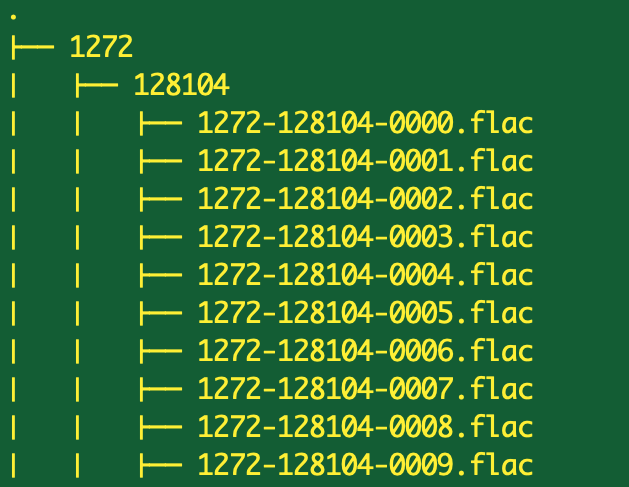

# Mawdoo3 AI Task

### Data used: (dev-clean, train-clean-100) folders from the OpenSLR dataset: http://www.openslr.org/12/

### Work done on: "train_openSLR.ipynb" & "train_openSLR_2.ipynb" using pytorch

The data extracted consists of two separate folders (training, validation/testing), within these folders data is stored in the following manner:

The first subtree/directory represents the user Id, the second subtree represents the session belonging to the parent user Id, the files (.flac) within the session subtree represent short recordings (<15s), all of which record the user actively reading in english.

The training section of the extracted data consists of about 100 hours of such recordings evenly split between male/female readers (50.20 hours/ 50.38 hours respectively).

There exists a "speaker.txt" file packaged with the zip files containing the aforementioned extracted directories which contains the following information:
- Id of each user
- The subset of the dataset this row belongs to (we use dev-clean and train-clean-100 only)
- The number of minutes this user speaks (within the provided subset)
- The sex of that user

Note: with the help of oscarknagg (github.com/oscarknagg) I fixed some issues within the speaker.txt file where some users where misclassified in their gender.

### Pre-processing
First Model (train_openSLR.ipynb):
With the help of oscarknagg, preprocessing of the directory into workable torch tensors was already available, as will be indicated in the workbook. The directories were accessed sequentially using the os.walk() method in python which allowed the files to be indexed by Id to filepath and Id to sex, which in turn allowed the creation of the torch dataset that is then loaded onto the torch dataloader for training.

Second Model (train_openSLR_2.ipynb):
Preprocessing of the directory into accessible, indexed audio files was taken from the first model. Features were extracted as indicated by the "Extracted Features" section below. These features then populated the torch dataset which the dataloader loads in preparation for training.

### Visualisation
Simple initial visualisations were made on "processing_openSLR.ipynb".

### Extracted Features
For the second model, a Mel-frequency cepstral coefficients (mfcc) calculation was done on each audio file, creating a 4x10 matrix of float values. These features were saved and later on extracted to perform 2D convolutions on a CNN.

### Model
First Model: The first model follows the intuition/knowledge of oscarknagg in his model, where the overall layer structure is the same. The changes I made after understanding and implementing his work include removing a couple of convolutional layers and downsampling the input data 4 times among other tinkerings. The main reasons behind these changes are testing my understanding of the code and lifting the heavy workload from my cpu by simplyfying both the model and the input data.
Model Structure: 
- Six 1D convolutional layers with 1 fully connected layer (Convolution, Activation, Batch Norm, Pooling).
- Loss Function: Binary Cross Entropy.
- Step Function: SGD.

Second Model: The second model follows the idea of using an mfcc calculated matrix as input to a 2D CNN for audio files that I discovered through: https://medium.com/@mikesmales/sound-classification-using-deep-learning-8bc2aa1990b7
Model Structure:
- Four 2D convolutional layers with 1 fully connected layer (Convolution, Activation, Pooling, Dropout).
- Loss Function: Binary Cross Entropy.
- Step Function: SGD.

### Results
First Model: 97% Accuracy on validation set (oscarknagg scored approx. 99%)

Second Model: 89% Accuracy on validation set

Comparison: The first model scores significantly higher than the second. This is probably because the second model takes a very simple 4x10 mfcc matrix as input as compared to the 3 seconds * 16000 points input for the first. The first model also contains more hidden layers.
